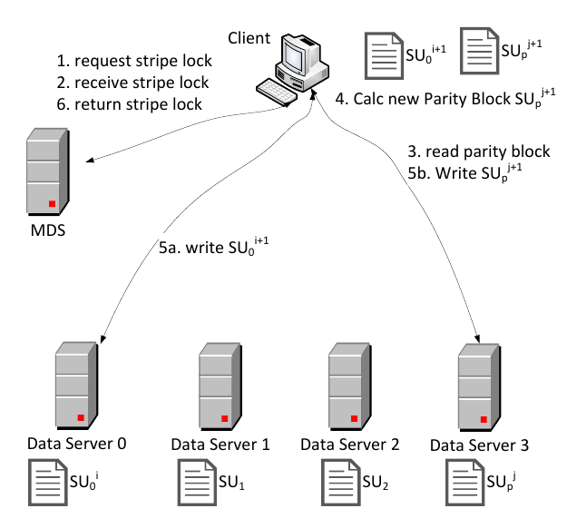
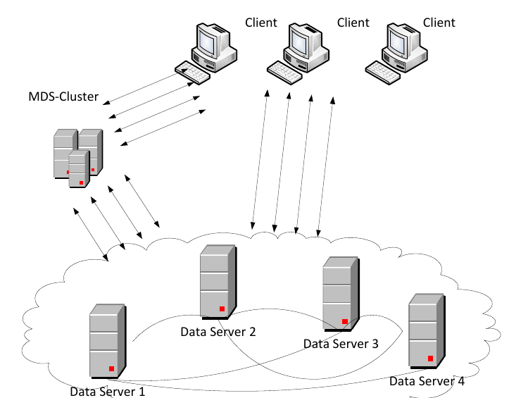
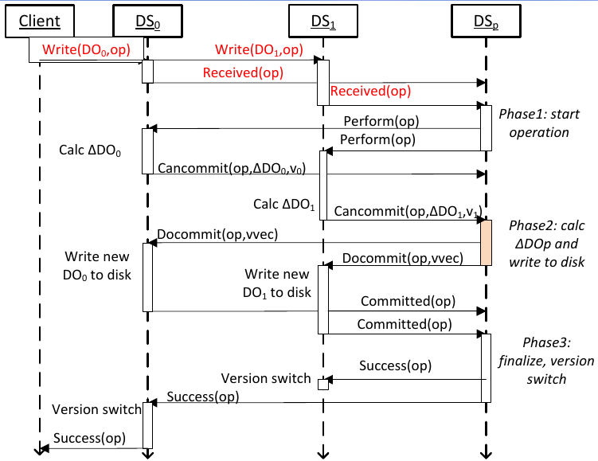
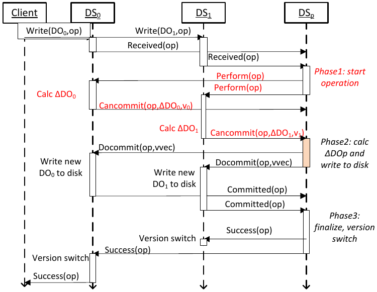
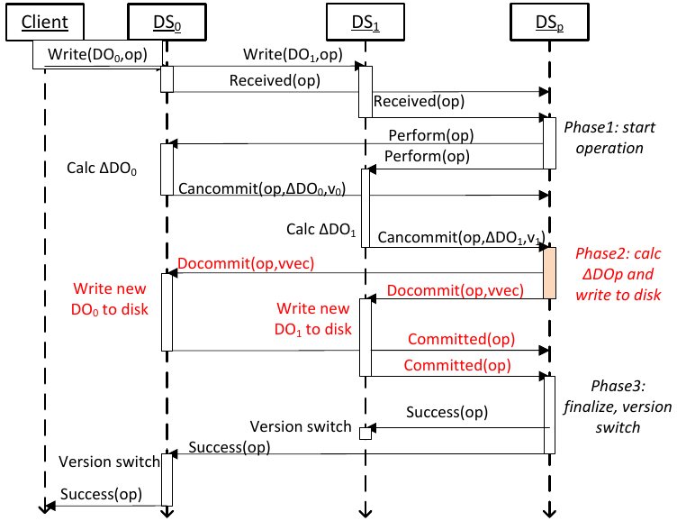
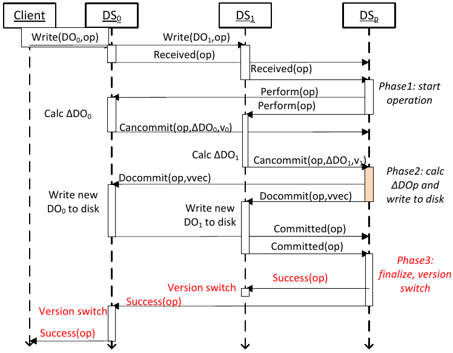
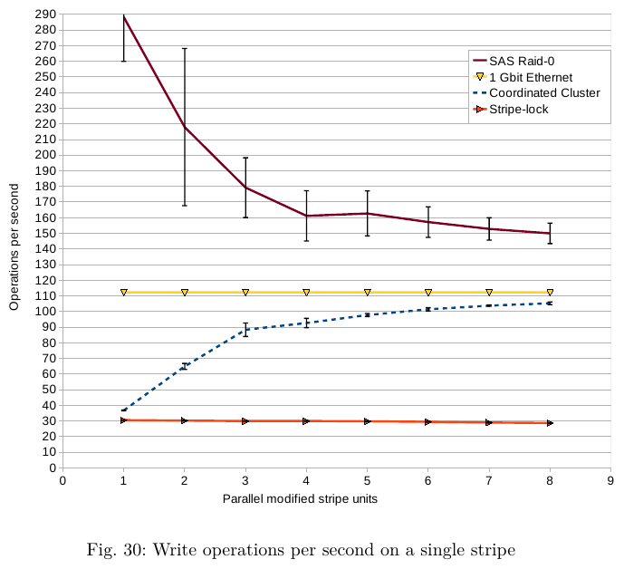
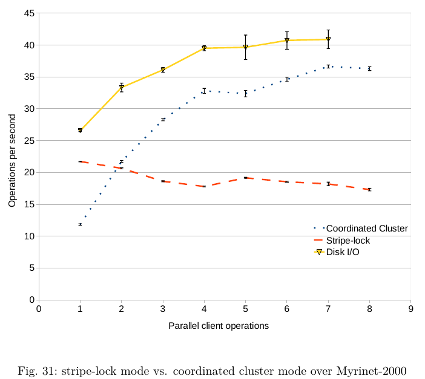
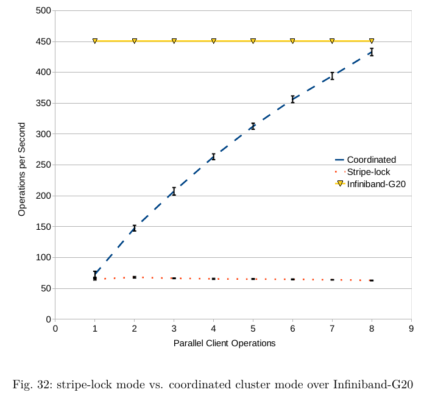
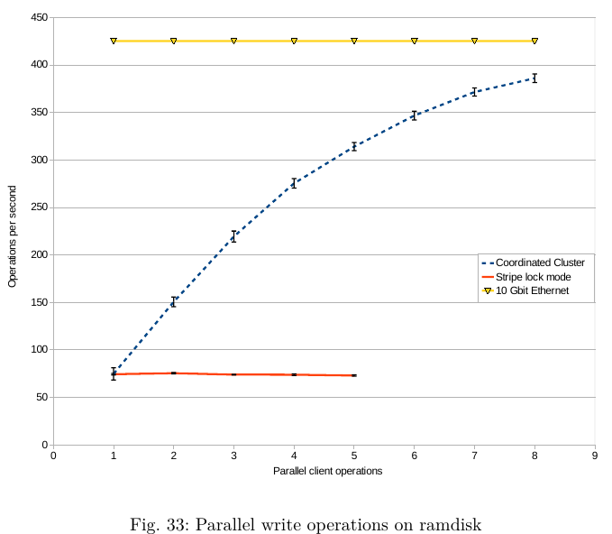

# Master-Thesis

Title: Overcoming write penalties of conflicting client operations in distributed storage systems

Basically, it's a redundant, lock-free distributed RAID-4/5 controller 

For details please refer to the presentation or thesis. 

# Problem:
Erasure coding in distributed environments:

# P2P Cluster: 

Solution: A P2P Cluster with distributed, redundant, multi-version state management and a lock-free commit protocol

# Evaluation 

The system has been evaluated at the Grid5000 Clusters Suno, Helios, Griffon, Granduc and Luxembourg
The graph show that my lock-free cluster saturate the hardware by over 90%.

